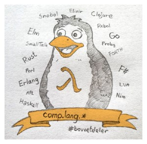

    

<b>comp.lang.*</b> er et fagkveldkonsept i bouvet bergen hvor vi sammen utforsker ulike programmeringsspråk og relaterte teknologier. Vi møtes en gang i måneden med et nytt tema hver gang.

## Format

- Kvelden starter med en **presentasjon** av valgt språk/tema. Det fokuseres på hva som gjør at teknologien skiller seg ut, og hva som kan gjøre den interessant og aktuell å bruke tid på.
- Det oppfordres til **høy grad av interaktivitet**; spørsmål og diskusjoner underveis er bra. Men foredragsholder er ikke nødvendigvis en ekspert på temaet, så noen svar må man finne i felleskap eller utsette til senere.
- Andre halvdel av kvelden får alle deltagere prøve å ta teknologien i bruk. **Noen enkle oppgaver** har blitt gjort klar, og man kan jobbe selvstendig eller i par eller grupper på medbrakt laptop.
- Det blir matservering.

## Hvem kan delta?

Alle i Bouvet som har interesse og lyst kan delta. Arrangementet annonseres i utgangspunktet kun internt, men ansatte oppfordres til å også invitere med seg venner og kjente i bransjen.

Påmelding gjøres på [event.bouvet.no](https://event.bouvet.no/).

## Møtelogg

- *1. juli 2019* - ***Go*** presentert av Torbjørn
- *13. august 2019* - ***Haskell***  presentert av Lorentz
- *19. september 2019* - ***Game Show på BouvetOne Bergen***

## Kontakt

Lurer du på noe eller har lyst å bidra? Kontakt [Robert](https://bouvet.slack.com/team/UCPD6UPNC) eller [Torbjørn](https://bouvet.slack.com/team/UCMA2CT1C), eller gi lyd på den dedikerte [Slack-kanalen](https://bouvet.slack.com/messages/CKV4RNBHD).
